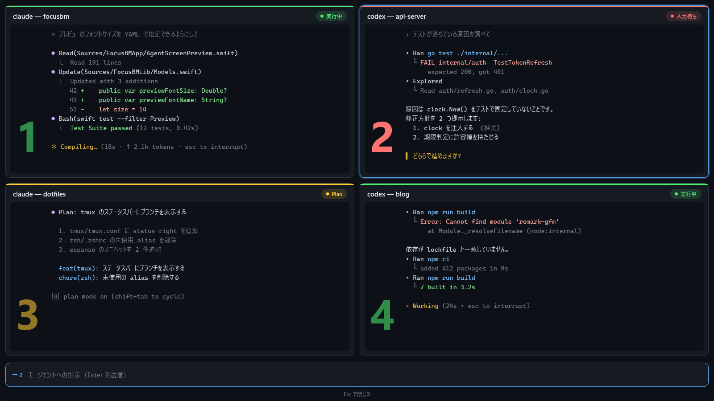

# focusbm

[日本語版 (README_ja.md)](./README_ja.md)

A bookmark tool for app focus management. The macOS **CLI** and **menu bar app** are the primary implementation. Windows is a .NET port in `dotnet/` (WPF tray + CLI).

## Overview

| Tool | Type | Description |
|---|---|---|
| `focusbm` | CLI (macOS) | Add, restore, and manage bookmarks via subcommands |
| `FocusBMApp` | Menu bar app (macOS) | Floating search panel invoked by a global hotkey |
| `FocusBM.Cli` / `FocusBM.exe` | CLI + tray (Windows) | Same YAML bookmarks, built from `dotnet/` |

`make` with no target follows `$PC`: `PC=wsl` runs `make release` (Windows `FocusBM.exe` into `release/`); any other value (including unset, typical on a Mac) runs `scripts/dev-relaunch.sh`. Windows install and smoke steps: [README_win.md](./README_win.md).

---

## CLI Tool (focusbm)

### Subcommands

| Subcommand | Description |
|---|---|
| `add <name> <bundleId>` | Manually add a bookmark (generates YAML template) ⭐ Recommended |
| `edit` | Open the bookmark YAML in your editor ⭐ Recommended |
| `save <name>` | Save the currently focused app as a bookmark (auxiliary command) |
| `restore <name>` | Restore and focus the specified bookmark |
| `restore-context <context>` | Restore all bookmarks in a context at once |
| `switch` | Filter and select a bookmark using fzf, then restore |
| `list` | Display the list of bookmarks |
| `delete <name>` | Delete the specified bookmark |
| `tmux-list` | List AI agent sessions running in tmux (see tmux Integration) |

### Usage

#### Recommended Workflow: Define in YAML → Restore

Since the `save` command can only capture the frontmost app, **manually defining bookmarks in YAML is the recommended workflow**.

##### 1. Add a bookmark (`add` command)

```sh
# Add an app bookmark
focusbm add mywork com.example.app --context work

# Specify a display name
focusbm add mywork com.example.app --app-name "My App" --context work

# Browser bookmark (URL pattern)
focusbm add pr com.microsoft.edgemac --url "github.com/pulls" --context dev

# Browser bookmark (tab index)
focusbm add slack com.google.Chrome --url "app.slack.com" --tab-index 3 --context work

# Regex pattern
focusbm add taskchute "^com\\.electron\\.taskchute" --app-name "TaskChute Cloud"
```

##### 2. Edit YAML directly

```sh
# Open YAML in $EDITOR
focusbm edit
```

##### 3. Restore a bookmark

```sh
focusbm restore mywork

# Select and restore using fzf
focusbm switch

# Restore all bookmarks in a context
focusbm restore-context work
```

#### Auxiliary: Save the current app (`save` command)

Use this to quickly bookmark the current frontmost app. Note that only the currently focused app can be captured.

```sh
# Save the current focus state as "mywork"
focusbm save mywork

# Save with a context (tag)
focusbm save mywork --context project-a
```

#### Display the bookmark list

```sh
# Default display (grouped by context)
focusbm list

# Filter by context
focusbm list --context project-a

# fzf-compatible output format (for pipe input)
focusbm list --format fzf
```

#### Delete a bookmark

```sh
focusbm delete mywork
```

---

## Menu Bar App (FocusBMApp)

### Overview

- Lives in the menu bar and brings up a Spotlight-style floating search panel via a global hotkey
- Incrementally search and select bookmarks from the panel to bring apps or browser tabs to the front
- Fully keyboard-driven (↑↓ to navigate, Enter to restore, Esc to close)

### Download

Prebuilt binaries are attached to each [GitHub Release](https://github.com/nekowasabi/focusbm/releases): `FocusBM-vX.Y.Z-mac.dmg` (macOS app) and `FocusBM-vX.Y.Z-windows-x64.zip` (Windows, requires the .NET 8 runtime). The dmg is ad-hoc signed and not notarized; on first launch, right-click → Open.

### How to Launch

```sh
# Build debug and run
swift build
.build/debug/FocusBMApp
```

### Global Hotkey

The default hotkey to open the search panel is **Cmd+Ctrl+B**.
The default hotkey to force-refresh the AI agent process list is **Cmd+Ctrl+R**.
The default panel hotkey to open the GitHub pull request recorded for the selected Claude Code or Codex session is **Cmd+P**.

You can change it in the `settings` section of your YAML (see below).
The pull-request action first runs `gh pr view --json url --jq .url` in the selected Claude Code or Codex process or tmux pane's working directory. Claude Code falls back to a structured `prUrl` in its session index; Codex intentionally does not use that Claude-specific fallback. It does nothing when no pull request is found, the data is invalid, or multiple pull requests conflict. The search panel refreshes pull-request results in the background and shows a `#<number>` label for a resolved working directory.

### Agent Screen Preview

`Ctrl+P` shows the hovered (or selected) AI agent's tmux pane; `Ctrl+V` tiles every agent. Escape closes the preview, not the panel.



- **Status and index** — each pane shows its agent status (running / Plan / waiting for input) and a large index in the status color, placed left of the text at the same height in every pane (level with the end of the longest output), so you can pick the prompt target without looking to a corner
- **Colors** — captured with `capture-pane -e`, so the pane's ANSI colors are rendered as-is (status detection still uses a plain capture)
- **Live update** — while a preview is open, panes are re-captured every 0.5 s and only changed panes are redrawn. The timer stops when the preview closes
- **Send a prompt** — a single-line input at the bottom sends text to the target pane with Enter (`load-buffer` → `paste-buffer -p` → `send-keys Enter`, so newlines, symbols and Japanese stay intact). In the tiled view, pick the target with `previewTargetModifier` + number; a bare number moves to that pane
- **While a preview is open**, re-pressing `togglePanel` and bookmark shortcuts are disabled so they cannot run a bookmark behind the preview

### Shortcut Bar

When the query is empty, the bookmark marked `executeOnToggleRepress` is removed from the main list and shown as a chip in the shortcut bar, labeled with the `togglePanel` hotkey (e.g. `⌃,`). It does not consume a number.

### Required Permissions

**Accessibility permission** is required to restore apps and browser tabs.

On first launch or if restoration fails, grant permission as follows:

1. System Settings → Privacy & Security → Accessibility
2. Add `FocusBMApp` (or `.build/debug/FocusBMApp`) and enable it

> Accessibility permission is required because browser tab restoration relies on System Events / AppleScript access.

---

## Supported Apps

- **Browsers** — Save and restore active tab URL patterns, titles, and tab indices
  - Microsoft Edge, Google Chrome, Brave Browser, Safari — tab search and switching by URL supported
  - Firefox — tab switching is supported **only when `tabIndex` is specified**, via the Cmd+N shortcut (see below)
- **Other apps** — Save window titles and bring apps to the front using bundleIdPattern (supports regex)
- **Floating window apps** — Dynamically enumerate floating windows of LSUIElement apps (such as Alter) that do not appear in Cmd+Tab, and switch between them at runtime
- **iTerm2 + tmux + Neovim** — `type: itermNvim` fronts the matching `nvim` pane and sends one fixed Ex command. iTerm2 only; see below.

---

## Requirements

- macOS 13 (Ventura) or later (Swift app)
- Swift 6.0 or later
- Xcode (for running tests)
- fzf (for the CLI `switch` command)
- GitHub CLI (`gh`, used to resolve pull requests)
- Windows / WSL: .NET 8 SDK or later (`PC=wsl make` or `make release`). Newer SDKs (e.g. .NET 10 on WSL) work via `DOTNET_ROLL_FORWARD=LatestMajor`, exported by the Makefile

---

## Building

```sh
# Default: macOS relaunch, or Windows release when PC=wsl
make

# Debug build (builds both CLI and menu bar app)
swift build

# Run tests (scripts/test.sh cleans up orphaned test-runner processes
# left behind by interrupted runs; plain `swift test` also works)
./scripts/test.sh

# Release build (macOS binaries)
swift build -c release

# Windows: restore/build/test the .NET solution
make win-build
make win-test

# Windows: publish to artifacts/ (framework-dependent) or self-contained single-file
make win-publish
make win-exe

# Windows: single-file release/FocusBM.exe (also the default when PC=wsl)
make release

# List all targets / remove dotnet build artifacts
make help
make win-clean
```

## Installation

### Menu Bar App (FocusBMApp.app)

A bundling script generates a release-built `.app` bundle.

```sh
# Create .app bundle (release build → generates FocusBMApp.app)
./scripts/bundle.sh

# Install to /Applications
cp -r FocusBMApp.app /Applications/

# Launch
open FocusBMApp.app
```

Double-click or use the `open` command to launch it as a native app (no terminal required).

### CLI (focusbm)

```sh
swift build -c release
cp .build/release/focusbm /usr/local/bin/focusbm
```

---

## Data Storage

Bookmarks and settings are stored in YAML format at the following path:

```
~/.config/focusbm/bookmarks.yml          # macOS
release/bookmarks.yml                    # Windows, next to FocusBM.exe after make release
%AppData%/focusbm/bookmarks.yml          # Windows fallback
```

Examples: [`bookmarks.example.yml`](./bookmarks.example.yml) (macOS) and [`bookmarks.example.windows.yml`](./bookmarks.example.windows.yml) (Windows). Override the Windows path with `FOCUSBM_YAML`.

If a legacy V1 `bookmarks.yml` exists, it will be automatically migrated to V2 format on first load (the original file is preserved as `.bak`).

---

## Manual YAML Editing

You can directly edit `~/.config/focusbm/bookmarks.yml` to use regex patterns and configure advanced settings.

### Bookmark Definition Examples

```yaml
bookmarks:
  - id: taskchute
    bundleIdPattern: "^com\\.electron\\.taskchute"
    appName: TaskChute Cloud
    context: work
    state:
      type: app
      windowTitle: ""
    createdAt: "2025-02-18T09:00:00Z"

  - id: github-pr
    bundleIdPattern: com.microsoft.edgemac
    appName: Microsoft Edge
    context: dev
    state:
      type: browser
      urlPattern: "github.com/myorg/pull"
      title: "PR Review"
      tabIndex: 2
    createdAt: "2025-02-18T09:00:00Z"

  - id: slack-inbox
    bundleIdPattern: com.google.Chrome
    appName: Google Chrome
    context: work
    state:
      type: browser
      urlPattern: "https://app.slack.com/client/T0APA1XEE/activity-inbox"
      title: "Slack"
      urlPrefix: "https://app.slack.com/client/T0APA1XEE"  # optional
    createdAt: "2025-02-18T09:00:00Z"

  - id: rarely-used
    appName: SomeApp
    bundleIdPattern: com.example.someapp
    context: work
    noShortcut: true   # No ⌘1-9 badge; subsequent items are numbered consecutively
    lowPriority: true  # Moved to the bottom of the list when there is no query
    state:
      type: app
      windowTitle: ""
    createdAt: "2025-01-01T00:00:00Z"
```

### settings Section

Add a `settings` section to `bookmarks.yml` to configure the menu bar app behavior.

```yaml
settings:
  hotkey:
    togglePanel: "cmd+ctrl+b"
    forceReloadAgents: "cmd+ctrl+r"
    openSessionPullRequest: "cmd+p"
    previewHoveredAgent: "ctrl+p"
    previewAllAgents: "ctrl+v"
  previewTargetModifier: "cmd"  # Modifier + number picks the prompt target in the tiled preview (cmd / ctrl)
  displayNumber: 1
  listFontSize: 15.0   # Defaults to system .body size (≈13pt) if omitted
  panelWidth: 600         # Search panel width in px (default: 500)
  panelHeight: 500        # Search panel height in px (default: 400)
  fontName: "Fira Code"   # Font for the filter screen (default: system monospaced)
  previewWidth: 1200      # Preview card width (default: max width of the target monitor)
  previewHeight: 800      # Preview card height (default: max height of the target monitor). Ctrl+P is centered
  previewFontSize: 16     # Preview font size (default: 14)
  previewFontName: "JetBrains Mono"  # Preview font (default: fontName)
  preferredTerminal: "com.github.wez.wezterm"  # Preferred terminal (bundleId)
  directNumberKeys: true    # Bare number keys focus a bookmark (false: Cmd+number only)
  # filteredNumberKeys: false # true: bare number keys also select while filtering (2+ candidates)
  showAIAgentShortcut: true # Number AI agent rows (aiProcess / tmux pane agents); false hides the numbers

bookmarks:
  - id: ...
```

| Key | Type | Default | Description |
|---|---|---|---|
| `settings.hotkey.togglePanel` | string | `"cmd+ctrl+b"` | Global hotkey to invoke the search panel. Pressing it again while the panel is open executes the bookmark marked `executeOnToggleRepress` (falls back to the selected item; closes the panel when nothing can run) |
| `settings.hotkey.forceReloadAgents` | string | `"cmd+ctrl+r"` | Global hotkey to force-refresh the AI agent process list |
| `settings.hotkey.openSessionPullRequest` | string | `"cmd+p"` | Panel hotkey to open the selected Claude Code or Codex session's GitHub pull request URL. Invalid and reserved shortcuts fall back to the default |
| `settings.hotkey.previewHoveredAgent` | string | `"ctrl+p"` | Panel hotkey to show a screen-only tmux capture of the hovered (or selected) AI agent. Escape closes the capture, not the panel |
| `settings.hotkey.previewAllAgents` | string | `"ctrl+v"` | Panel hotkey to tile screen-only tmux captures of every AI agent. Escape closes the capture, not the panel |
| `settings.displayNumber` | integer | `1` | Display number where the panel appears (1-based) |
| `settings.listFontSize` | float | `nil` (≈13pt) | Font size (pt) for the candidate list. Uses system default if omitted |
| `settings.panelWidth` | integer | `500` | Search panel width (px) |
| `settings.panelHeight` | integer | `400` | Search panel height (px) |
| `settings.fontName` | string | `nil` (system monospaced) | Font name for the filter screen (candidate list). Uses the system monospaced font if omitted |
| `settings.previewWidth` | integer | `nil` (max width of the target monitor) | Width (px) of the single Ctrl+P card. The all-agents preview (Ctrl+V) uses the whole monitor |
| `settings.previewHeight` | integer | `nil` (max height of the target monitor) | Height (px) of the single Ctrl+P card. The single card is centered; the all-agents preview is full-screen |
| `settings.previewFontSize` | float | `14` | Preview font size (pt) |
| `settings.previewFontName` | string | `nil` (falls back to `fontName`) | Preview font name |
| `settings.previewTargetModifier` | string | `"cmd"` | Modifier key (`cmd` / `ctrl`) that picks the prompt target in the tiled preview. Invalid values fall back to `cmd` |
| `settings.preferredTerminal` | string | `nil` | bundleId of the terminal used to open tmux panes (e.g. `"com.github.wez.wezterm"`). Takes priority over auto-detection |
| `settings.directNumberKeys` | bool | `true` | `true`: bare number keys focus a bookmark. `false`: Cmd+number only |
| `settings.filteredNumberKeys` | bool | `false` | `true`: while filtering with 2+ candidates, bare number keys select the renumbered row. `false`: digits are typed into the query and only Ctrl+number selects |
| `settings.showAIAgentShortcut` | bool? | `nil` (= `true`) | `true`/omitted: AI agent rows (`aiProcess` and tmux pane agents) also get ⌘1–⌘9 numbers. `false`: AI agent rows are not numbered, bookmark numbers stay contiguous (1, 2, 3...), and number-key jumps no longer reach AI rows |

### Field Descriptions

- **bundleIdPattern** — Specifies the app's bundle ID as a regex pattern. Supports prefix or exact match, e.g., `^com\.electron\.taskchute`
- **urlPattern** — Partial match pattern for the active browser tab's URL
- **tabIndex** — Browser tab index (1-based). If specified, restoration jumps directly to that tab. When used together with `urlPattern`, `tabIndex` takes priority but falls back to URL search if the URL does not match. If omitted and `urlPattern` is set, the URL is opened directly via `open location` (the `https://` prefix is added automatically). If neither is set, the app is simply activated
- **urlPrefix** — (Optional) If a tab whose URL starts with this prefix is already open, switches to that tab instead of opening a new one. Useful for apps like Slack where the URL changes per page/channel. If omitted, `urlPattern` is used for exact matching as usual
- **noShortcut** — (Optional) If `true`, the item is not assigned a ⌘1–⌘9 shortcut badge. Subsequent items are numbered consecutively without skipping. Defaults to `false` (or omit the field)
- **enables** — (Optional) If `false`, the bookmark is hidden from lists (menu bar, search panel, `list`, `switch`). It stays in the YAML. Defaults to `true` (or omit the field)
- **lowPriority** — (Optional) If `true`, the item is moved to the bottom of the list when there is no search query. In search mode it appears in score order like any other item. Defaults to `false` (or omit the field)
- **executeOnToggleRepress** — (Optional) If `true`, pressing the togglePanel hotkey again while the panel is open executes this bookmark regardless of the query or selection. Only the first matching bookmark is used. Defaults to `false` (re-press executes the selected item)

### Notes on Using Firefox

Firefox does not have an AppleScript API for enumerating tabs or searching by URL (`tabs of windows`), so its behavior differs from Chrome/Safari.

| Condition | Behavior |
|------|------|
| `tabIndex` specified | Sends Cmd+N shortcut via System Events to jump to the Nth tab |
| `tabIndex: 9` or higher | Jumps to Cmd+9 (last tab) per Firefox's official behavior |
| No `tabIndex` / `urlPattern` specified | Opens the URL in a new tab via `open location` (`https://` is added automatically) |
| Neither `tabIndex` nor `urlPattern` | Simply activates Firefox (no tab switching) |

**Recommended Firefox bookmark configuration:**

```yaml
- id: github
  appName: Firefox
  bundleIdPattern: org.mozilla.firefox
  context: dev
  state:
    type: browser
    urlPattern: github.com   # Informational only (not used for search)
    title: GitHub
    tabIndex: 3              # Tab position from the left (1-based)
  createdAt: "2025-01-01T00:00:00Z"
```

> **Note**: `tabIndex` will stop working if the tab position changes. It is recommended to keep tabs in fixed positions or pin them.

### Floating Window Apps (e.g., Alter)

To switch between floating windows of LSUIElement apps that do not appear in Cmd+Tab, use `type: floatingWindows`. Window titles are automatically retrieved at app launch, so you do not need to specify them in YAML.

```yaml
- id: alter
  appName: Alter            # App name (used for CGWindowList matching)
  bundleIdPattern: ""       # bundleId not required
  context: tools
  state:
    type: floatingWindows   # Dynamically enumerated at runtime
  createdAt: "2025-01-01T00:00:00Z"
```

Floating windows that exist when the panel is opened are listed as candidates (e.g., `Alter - Search the web - Hello`).

### iTerm2 + tmux + Neovim (`type: itermNvim`)

Restore a specific Neovim pane inside tmux on **iTerm2 only**, then send one fixed Ex command. This is not the legacy V1 `type: iterm2` (that still migrates to `type: app`).

```yaml
- id: project-nvim
  appName: iTerm2
  bundleIdPattern: com.googlecode.iterm2
  context: work
  state:
    type: itermNvim
  createdAt: "2026-08-15T00:00:00Z"
```

| Field | Rule |
|---|---|
| `workingDirectory` | Optional. If omitted, the first iTerm2 `nvim` pane is used. If set to an absolute path, that pane is preferred, then the first iTerm2 `nvim`. Machine-specific paths are not required. |
| `exCommand` | Optional. One-line Ex text **without** a leading `:`. Omitted/empty means focus only. CR, LF, NUL, or a leading `:` is rejected. |

**Eligible target:**

- `pane_current_command` is exactly `nvim` (not `vim`, not a wrapper)
- the tmux client is iTerm2 (`com.googlecode.iterm2`)

If several panes match, the first pane in one tmux `list-panes` snapshot is used. The restorer then switches that client TTY to that pane ID, re-reads `#{pane_id}`, selects the unique iTerm2 session whose TTY matches (window → tab → session), and sends Esc once then `:` + `exCommand` + Enter once.

**No command is sent when any of these is true:**

- no eligible pane, a non-iTerm2 client, or an empty/unknown TTY
- more than one iTerm2 session has the same TTY, or none does
- tmux switch/verify fails
- macOS Automation for FocusBM → iTerm2 is denied, or the Apple Event times out (5 seconds)

This path does **not** require Accessibility / System Events. Grant **Automation** permission so FocusBM can control iTerm2 (System Settings → Privacy & Security → Automation). Other terminals, Neovim outside tmux, and free-form input are out of scope.

---

## tmux Integration

focusbm now supports discovering and focusing tmux panes running AI agents.

### Supported AI agents

- Claude Code (`claude`)
- Codex (`codex`)
- Copilot (`copilot`)
- Devin CLI (`devin`)
- Aider (`aider`)
- Gemini (`gemini`)
- Hermes (`hermes`)
- OpenCode (`opencode`)
- Pi (`pi`)
- Grok Build (`grok`)

Non-interactive helper processes are excluded: OpenCode `serve`, Codex
`app-server` / `mcp-server`, and Chrome Native Host. Versioned Grok binaries
and agents launched via Node.js / Python runtimes are also detected.

### Status indicators

| Emoji | Status |
|-------|--------|
| ● | Running (thinking/generating) |
| ○ | Idle (waiting for input) |
| ⏸ | Plan mode |
| ⏵ | Accept edits mode |

### Terminal detection

When focusing a tmux pane, focusbm first prefers the tmux client that is
currently showing the target session/window and runs `switch-client -c` for
that client tty. If no window-level client is available, it falls back to the
session-level client and then the existing terminal detection path.

`settings.preferredTerminal` is only a fallback for display and activation; it
does not replace a client tty already reported by tmux. Bringing the terminal
app forward can still depend on macOS and terminal window behavior, so focusbm
does not guarantee that a specific terminal window becomes frontmost.

| Terminal | Emoji |
|----------|-------|
| Ghostty | 👻 |
| iTerm2 / Terminal.app | 🍎 |
| WezTerm | ⚡ |
| Alacritty | 🔲 |

### CLI verification

```bash
focusbm tmux-list
# Found 3 AI agent session(s):
#   [0] 👻 ● Claude Code — focusbm
#   [1] 👻 ○ Claude Code — tmux-hint
```

---

## Project Structure

```
focusbm/
├── .github/workflows/           # windows-smoke-not-feasibility CI (dotnet test + evidence lint)
├── Makefile                     # PC=wsl → release (Windows exe), else macOS relaunch
├── bookmarks.example.yml        # macOS YAML schema
├── bookmarks.example.windows.yml # Windows YAML schema
├── README_win.md                # Windows install & smoke-test walkthrough
├── dotnet/                      # Windows .NET 8 solution (FocusBM.sln)
│   ├── FocusBM.Core/            # Platform-independent models/search/storage
│   ├── FocusBM.Infrastructure.Windows/ # Windows OS integration (activation, WSL, CDP)
│   ├── FocusBM.Cli/             # Windows CLI (FocusBM.Cli.exe)
│   ├── FocusBM.App.Wpf/         # Tray + search panel WPF app (FocusBM.App.Wpf.exe)
│   ├── FocusBM.Windows.Spikes/  # Feasibility spikes
│   └── *.Tests/                 # Core/Cli/App.Wpf/Infrastructure.Windows test projects
├── scripts/
│   ├── test.sh                  # swift test with orphan test-process cleanup
│   ├── dev-relaunch.sh          # macOS app rebuild + relaunch
│   ├── bundle.sh                # macOS .app bundling
│   ├── release-evidence-lint.ps1 # Windows release-gate evidence lint
│   └── windows/                 # publish/run/smoke/CDP PowerShell helpers
├── Package.swift
├── Sources/
│   ├── FocusBMLib/              # Shared library (core logic)
│   │   ├── Models.swift         # Data models and AppSettings
│   │   ├── BookmarkRestorer.swift  # Bookmark restoration logic
│   │   ├── AppleScriptBridge.swift # AppleScript / System Events bridge
│   │   ├── FloatingWindowProvider.swift # Floating window enumeration for LSUIElement apps
│   │   ├── TmuxProvider.swift   # tmux pane enumeration + AI agent detection
│   │   ├── ProcessProvider.swift # AI agent process detection
│   │   ├── ProcessSnapshot.swift # Process snapshot cache (fast filtering UI)
│   │   ├── NvimTmuxRestorer.swift # iTerm2+tmux+Neovim state restore (itermNvim)
│   │   ├── SessionPullRequestResolver.swift / ClaudeSessionPullRequestResolver.swift
│   │   ├── GitHubPullRequestCLI.swift # PR URL resolution via gh
│   │   ├── ActivationTarget.swift
│   │   ├── AppIconProvider.swift
│   │   └── YAMLStorage.swift    # YAML read/write and migration
│   ├── focusbm/                 # CLI entry point
│   │   └── focusbm.swift
│   └── FocusBMApp/              # Menu bar app
│       ├── main.swift           # Entry point
│       ├── FocusBMApp.swift     # AppDelegate and menu bar management
│       ├── BackgroundRefreshService.swift # Periodic agent-list refresh
│       ├── SearchPanel.swift    # Floating panel window
│       ├── SearchView.swift     # SwiftUI search UI
│       ├── SearchViewModel.swift # Search logic and state management
│       ├── ShortcutBarView.swift # Shortcut-key icon bar
│       └── BookmarkRow.swift    # Bookmark row component
└── Tests/
    └── focusbmTests/
```

### Dependencies

- [swift-argument-parser](https://github.com/apple/swift-argument-parser) — CLI subcommand definitions
- [Yams](https://github.com/jpsim/Yams) — YAML encoding and decoding

---

## Bookmark List Layout (List Columns)

The filter screen is always a single table column (key / status / name / app / terminal / PR / URL). The `bookmarkListColumns` key in `~/.config/focusbm/bookmarks.yml` is kept for compatibility: setting it to `2` with `panelWidth` omitted applies an 800px panel width. An explicit `panelWidth` always wins.

### Key bindings

- `↑↓`: move up/down (±1)
- `1`–`9`: run directly

See [`bookmarks.example.yml`](./bookmarks.example.yml) (macOS) and [`bookmarks.example.windows.yml`](./bookmarks.example.windows.yml) (Windows) for examples.

---

## License

MIT
